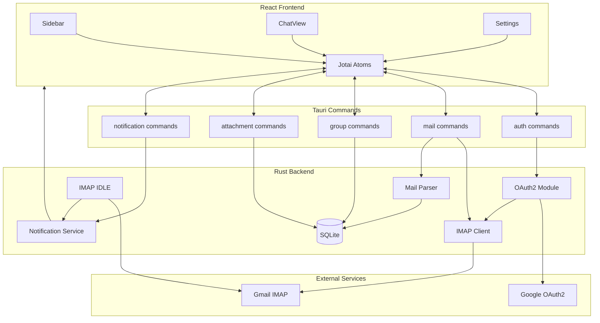
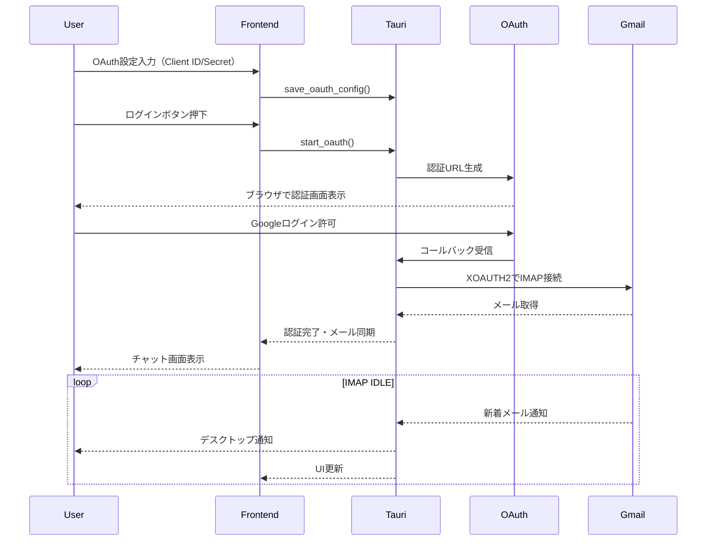
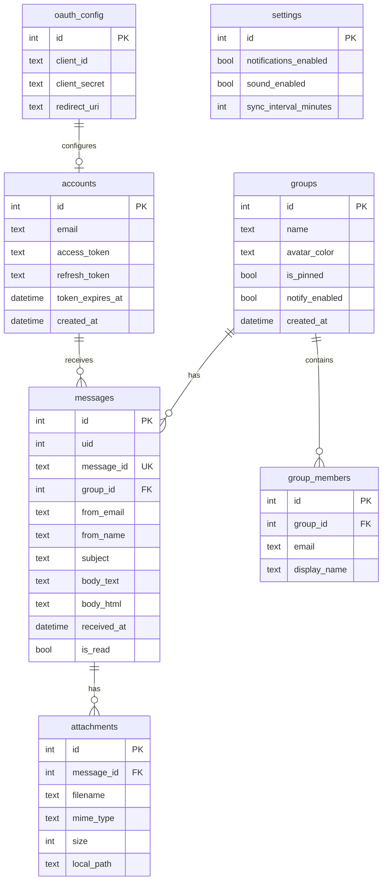
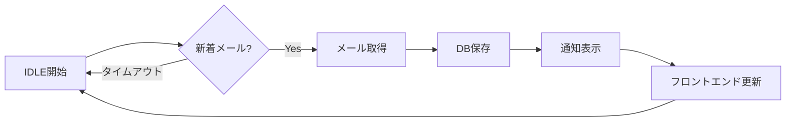

# ocha - チャット形式メールクライアント開発プラン

## 技術スタック

| レイヤー | 技術 |
|---------|------|
| フレームワーク | Tauri v2 |
| フロントエンド | React 18 + TypeScript + Vite |
| スタイリング | Tailwind CSS v4 |
| バックエンド | Rust |
| IMAP処理 | `async-imap` + `async-native-tls` クレート |
| メール解析 | `mailparse` クレート |
| データベース | SQLite (`rusqlite`) |
| 状態管理 | Jotai |
| OAuth2 | `oauth2` クレート + Google OAuth2 |
| 通知 | Tauri Notification Plugin |

## アーキテクチャ概要




## UI設計

### カラースキーム（グリーン基調ライトテーマ）

| 要素 | カラー |
|------|--------|
| 背景 | #f8faf8 |
| サイドバー背景 | #e8f5e9 |
| プライマリ | #2e7d32 |
| プライマリ（hover） | #1b5e20 |
| アクセント | #4caf50 |
| テキスト | #1a1a1a |
| テキスト（サブ） | #666666 |
| ボーダー | #c8e6c9 |
| 未読バッジ | #43a047 |

### レイアウト構成

```
┌──────────────────────────────────────────────────┐
│ ■ ocha                                    - □ X │
├────────┬─────────────────────────────────────────┤
│        │  山田太郎                      🔍  ⚙️  │
│ ────── ├─────────────────────────────────────────┤
│ グループ│                                        │
│ ────── │  ┌─────────────────────────────────┐   │
│        │  │ 山田太郎  10:30                 │   │
│ 山田(2)│  │ お疲れ様です。資料送ります。   │   │
│ 鈴木   │  │ 📎 報告書.pdf                   │   │
│ 営業   │  └─────────────────────────────────┘   │
│        │                                        │
│ ────── │  ┌─────────────────────────────────┐   │
│        │  │ 山田太郎  14:22                 │   │
│        │  │ 確認しました。問題ありません。 │   │
│ + 新規 │  └─────────────────────────────────┘   │
└────────┴─────────────────────────────────────────┘
```

### デザイン方針

- **全体**: クリーンでミニマルなライトテーマ
- **サイドバー**: グリーン系の淡い背景、グループリスト表示
- **メッセージエリア**: 白背景、送信者アバター + 名前 + タイムスタンプ + 本文
- **添付ファイル**: メッセージ内にファイルカード表示
- **未読バッジ**: グループ名横にグリーンのバッジで未読数表示

## フェーズ1: プロジェクトセットアップ

1. Tauri v2 プロジェクト初期化 (React + TypeScript + Vite)
2. Tailwind CSS v4 設定（グリーン基調ライトテーマ）
3. Jotai インストール・設定
4. Tauri Notification Plugin 追加
5. ディレクトリ構造の作成
6. Rustの依存クレート追加

## フェーズ2: データベース設計



## フェーズ3: OAuth2 認証実装

### 利用者のセットアップ手順

1. Google Cloud Console でプロジェクト作成
2. OAuth 2.0 クライアントID作成（デスクトップアプリ）
3. ocha の設定画面で Client ID / Client Secret を入力・保存
4. ログインボタンでOAuth認証開始

### 認証フロー

1. **設定保存** - Client ID/Secret をローカルDBに暗号化保存
2. **認証開始** - ローカルサーバー起動、ブラウザで認証URL開く
3. **コールバック** - 認証コード受信 → トークン取得
4. **IMAP接続** - XOAUTH2でGmail IMAP認証

## フェーズ4: Rust バックエンド実装

### モジュール構成

```
src-tauri/src/
├── main.rs
├── commands/
│   ├── mod.rs
│   ├── auth.rs        # OAuth2認証コマンド
│   ├── mail.rs        # メール取得・同期
│   ├── groups.rs      # グループ管理
│   ├── attachments.rs # 添付ファイル操作
│   └── settings.rs    # 設定管理（OAuth含む）
├── oauth/
│   ├── mod.rs
│   └── google.rs      # Google OAuth2実装
├── imap/
│   ├── mod.rs
│   ├── client.rs      # IMAP接続・操作
│   └── idle.rs        # IMAP IDLE（リアルタイム監視）
├── mail/
│   ├── mod.rs
│   └── parser.rs      # メール解析
├── notification/
│   ├── mod.rs
│   └── service.rs     # 通知サービス
└── db/
    ├── mod.rs
    └── models.rs      # データモデル
```

### 主要Tauriコマンド

- `save_oauth_config` - OAuth Client ID/Secret 保存
- `get_oauth_config` - OAuth設定取得
- `start_oauth` - OAuth2認証開始
- `check_auth_status` - 認証状態確認
- `logout` - ログアウト
- `sync_messages` - メール同期
- `start_idle_watch` - IMAP IDLE監視開始
- `stop_idle_watch` - IMAP IDLE監視停止
- `get_groups` - グループ一覧
- `get_messages` - グループ内メッセージ取得
- `mark_as_read` - 既読にする
- `create_group` / `update_group` / `delete_group`
- `add_email_to_group` / `remove_email_from_group`
- `download_attachment` - 添付ファイル保存
- `open_attachment` - 添付ファイルを既定アプリで開く
- `get_settings` / `update_settings` - 設定取得・更新

## フェーズ5: 通知機能実装

### 機能

1. **IMAP IDLE** - サーバーからのプッシュ通知を待機
2. **デスクトップ通知** - Tauri Notification Pluginで表示
3. **通知設定** - グローバル/グループごとのON/OFF
4. **未読管理** - 未読数をサイドバーにバッジ表示



## フェーズ6: フロントエンド実装

### コンポーネント構成

```
src/
├── components/
│   ├── Layout/
│   │   └── AppLayout.tsx
│   ├── Sidebar/
│   │   ├── Sidebar.tsx
│   │   ├── GroupSection.tsx
│   │   ├── GroupItem.tsx
│   │   └── UnreadBadge.tsx
│   ├── Chat/
│   │   ├── ChatHeader.tsx
│   │   ├── MessageList.tsx
│   │   ├── MessageItem.tsx
│   │   └── AttachmentCard.tsx
│   ├── Settings/
│   │   ├── SettingsModal.tsx
│   │   ├── OAuthConfig.tsx
│   │   ├── GroupEditor.tsx
│   │   └── NotificationSettings.tsx
│   └── Auth/
│       └── LoginScreen.tsx
├── atoms/
│   ├── authAtom.ts
│   ├── groupsAtom.ts
│   ├── messagesAtom.ts
│   ├── settingsAtom.ts
│   └── uiAtom.ts
├── hooks/
│   ├── useAuth.ts
│   ├── useGroups.ts
│   ├── useMessages.ts
│   └── useNotification.ts
└── App.tsx
```

### Jotai Atoms設計

```typescript
// authAtom.ts
export const authStateAtom = atom<'loading' | 'needs_config' | 'unauthenticated' | 'authenticated'>('loading')
export const oauthConfigAtom = atom<OAuthConfig | null>(null)
export const accountAtom = atom<Account | null>(null)

// groupsAtom.ts
export const groupsAtom = atom<Group[]>([])
export const selectedGroupIdAtom = atom<number | null>(null)
export const unreadCountsAtom = atom<Record<number, number>>({})

// messagesAtom.ts
export const messagesAtom = atom<Message[]>([])

// settingsAtom.ts
export const settingsAtom = atom<Settings>({
  notificationsEnabled: true,
  soundEnabled: true,
  syncIntervalMinutes: 5
})
```

## フェーズ7: 添付ファイル対応

1. **メール内添付ファイル検出** - `mailparse` で抽出
2. **メタデータ保存** - ファイル名、MIMEタイプ、サイズをDB保存
3. **遅延ダウンロード** - ユーザー操作時にダウンロード
4. **ファイルカード表示** - ファイル種別アイコン + 名前 + サイズ
5. **操作** - クリックで保存、ダブルクリックで開く

## ディレクトリ構造

```
ocha/
├── src/
│   ├── components/
│   ├── atoms/
│   ├── hooks/
│   └── App.tsx
├── src-tauri/
│   ├── src/
│   │   ├── main.rs
│   │   ├── commands/
│   │   ├── oauth/
│   │   ├── imap/
│   │   ├── mail/
│   │   ├── notification/
│   │   └── db/
│   ├── Cargo.toml
│   └── tauri.conf.json
├── docs/
│   └── plan.md
├── package.json
└── tailwind.config.js
```

## 将来の拡張（MVP後）

- 返信機能（SMTP + OAuth2）
- 複数アカウント対応
- メール検索機能
- スレッド表示（In-Reply-To解析）
